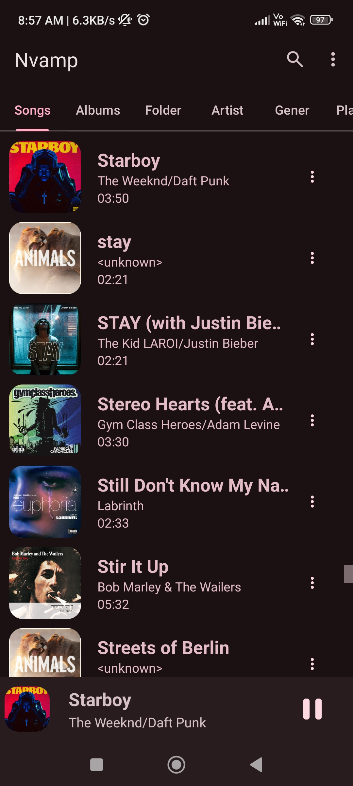
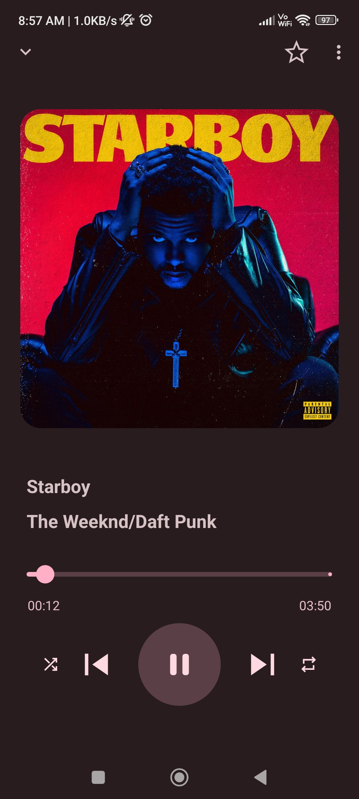
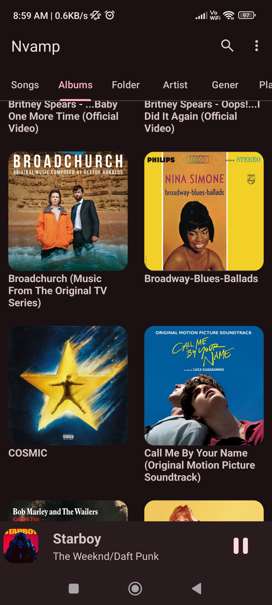
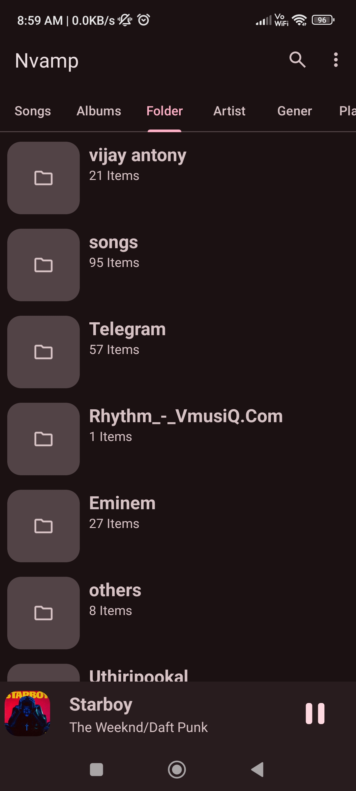
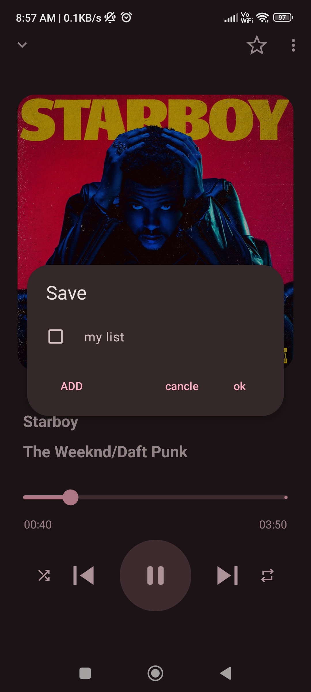
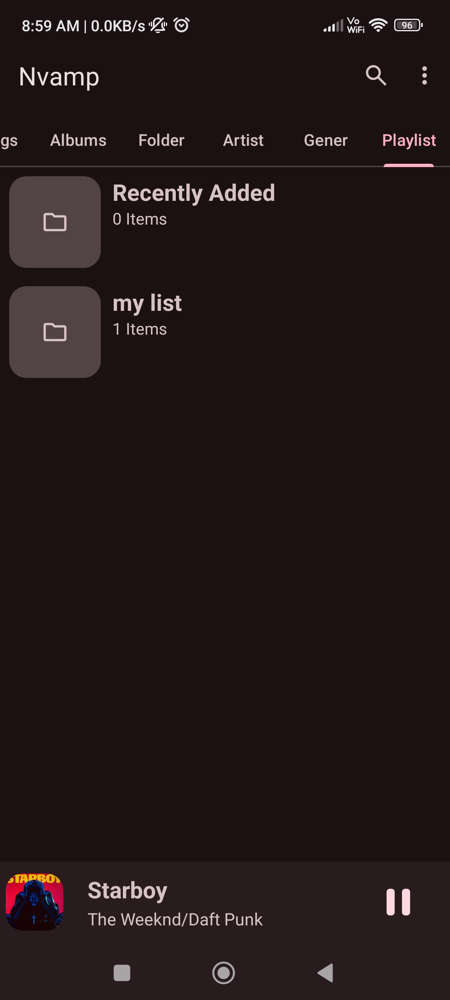

# Nvamp — Offline Music Companion

Nvamp is a **sleek, fast, and full-featured offline music player** for Android. With a minimalist aesthetic and smooth navigation, Nvamp makes enjoying your local music collection a total pleasure.


---

## Screenshots

<p float="left">
  
  
  
  
  
  
</p>

---

## Features

**Modern UI** – Clean dark theme with pink accent  
**Tabbed Navigation** – Easily browse by Songs, Albums, Folders, Artists, Genres, Playlists  
**Offline Playback** – Works completely without internet
**Album Art Support** – High-res cover art, beautifully displayed  
**Now Playing Screen** – Smooth transitions, play/pause, repeat & seek  
**Smart Queue** – Tap and listen with no lag
**Playlist Support** – Create and manage custom playlists  
**Folder View** – Play music by actual file structure  
**Lightweight & Fast** – Low memory footprint, smooth on all devices  
**No Ads** – Completely distraction-free experience  

---

## Contributing

Contributions welcome! You can:

- Improve the services and UI
- Fix process issues
- Enhance the UI design or functionality
- Add new features like new Google material3 animation
- Improve documentation


## Installation

Currently available as an APK. You can build it from source or sideload the release:

```bash
git clone https://github.com/your-username/nvamp.git
cd nvamp
# Open in Android Studio and run on device

